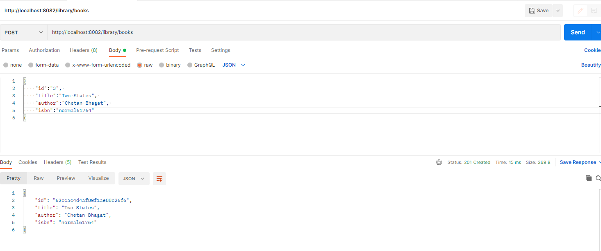

# springboot-swagger-gradle

## Mongo DB setup
C:\Program Files\MongoDB\Server\5.0\bin and launch command prompt

mongod

mongo

show dbs

create database

use library

db.books.insert({"name":"mongodb book"})

show collections

db.books.find()

## Calling Post Request through Postman

({"id":"1", "title":"The Princely State", "author":"Kaushik Sen", "isbn":"normal61761"})

## Gradle Commands
gradle clean build
./gradlew clean build
./gradlew bootRun

## Swagger UI link
https://localhost:8082/swagger-ui/
